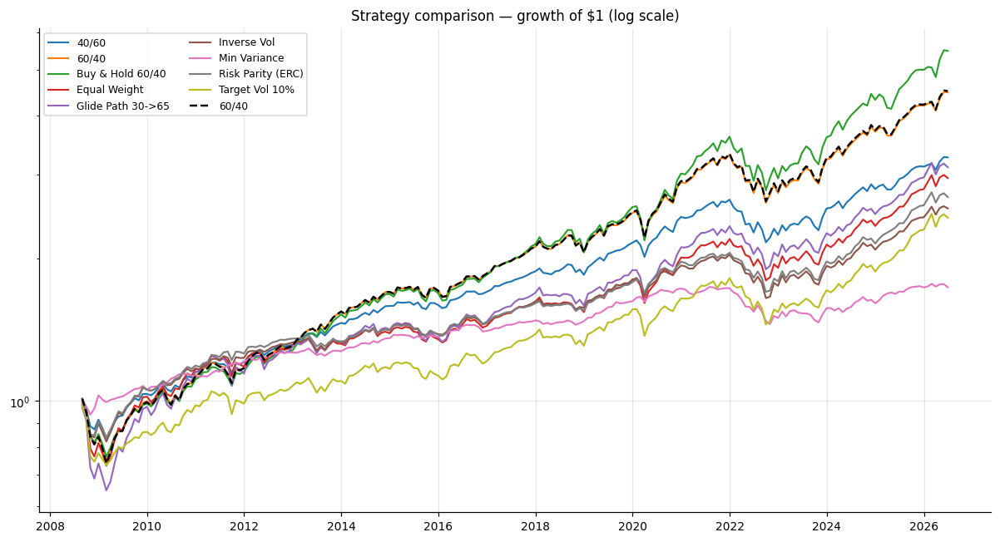
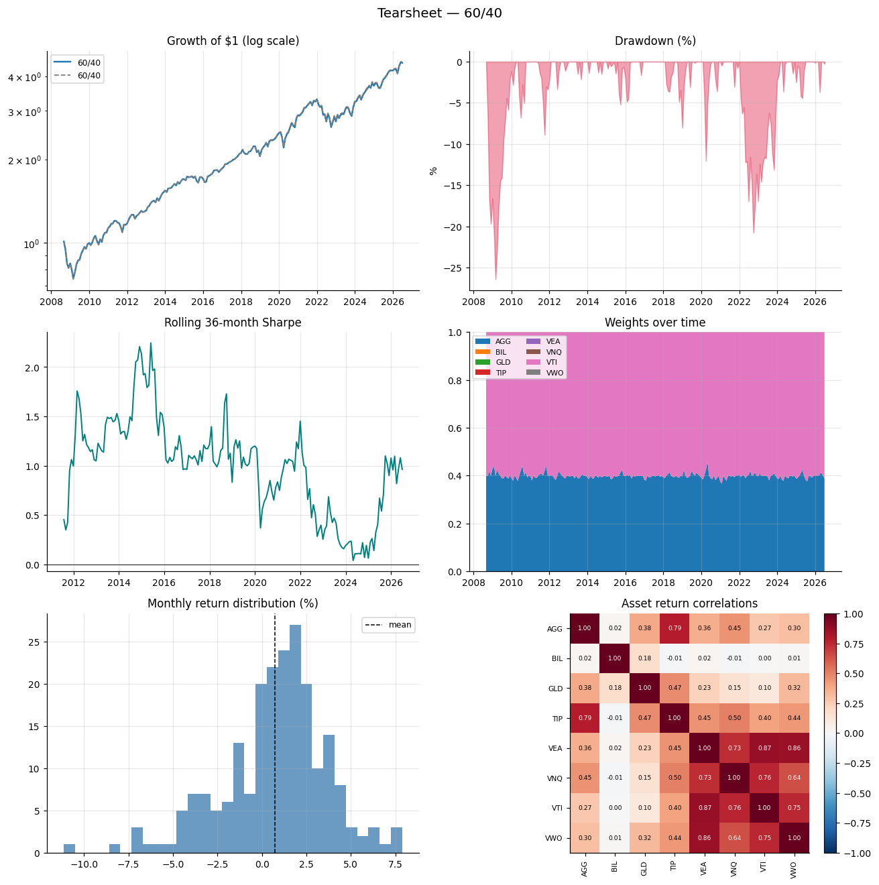

# Asset-Allocation Backtester & Benchmark-Relative Analytics Engine

A config-driven engine for backtesting multi-asset allocation strategies and analysing them **the way a portfolio analyst would** — on a benchmark-relative basis, with every metric implemented from first principles so the methodology is fully auditable.

The emphasis of this project is **correctness and defensible methodology**, not feature count. The analytical core (`backtester.metrics`) contains no hidden library calls: CAGR, Sharpe, tracking error, information ratio, up/down capture, beta, alpha, and the risk decomposition are all written out explicitly and unit-tested against hand-computed values (and cross-checked against `empyrical`).



---

## What it does & why it matters

Given a one-file YAML config, the engine:

1. Pulls **adjusted-close (total-return)** history for a diversified ETF universe and resamples to **monthly** returns, aligned to the longest common history and cached to `data/` as parquet (reproducible, runs offline after the first fetch).
2. Runs an allocation strategy (`history → target weights`) under a chosen **rebalancing policy** (calendar or drift-band threshold) with **transaction costs** and **turnover** tracked.
3. Produces a **tearsheet**, a **benchmark-relative** metrics summary, a per-asset **contribution-to-return and contribution-to-risk** decomposition, a strategy-comparison table (CSV + rendered), and a self-contained **HTML report** with charts embedded.

This is the daily loop of a multi-asset analyst: propose an allocation, test it out of sample, and explain its behaviour *relative to a policy benchmark* (here, 60/40) — active return, tracking error, information ratio, beta, capture ratios — not just its absolute numbers.

---

## Quick start (one command)

```bash
# 1. Install (Python 3.9+; creates/uses a virtualenv)
python -m venv .venv && source .venv/bin/activate
pip install -e ".[dev]"

# 2. Run a single strategy — downloads & caches data on first run
python -m backtester run --config configs/60_40.yaml

# 3. Compare every strategy on a benchmark-relative basis
python -m backtester compare --configs configs/*.yaml
```

`run` prints the headline metrics and writes `reports/<name>_summary.csv`, a tearsheet PNG, and an HTML report. `compare` writes a comparison table and an overlaid equity chart. Use `--help`, `-v` for debug logging, `--warmup N` to change the estimation warm-up, and `fetch` to pre-prime the cache.

---

## The universe

| Ticker | Exposure | Role |
|---|---|---|
| VTI | US total equity market | Growth |
| VEA | Developed ex-US equity | Growth |
| VWO | Emerging-market equity | Growth |
| VNQ | US REITs | Growth / real assets |
| GLD | Gold | Real asset / diversifier |
| AGG | US aggregate bonds | Defensive |
| TIP | US TIPS (inflation-linked) | Defensive / inflation |
| BIL | 1–3 month T-bills | **Cash / risk-free proxy** |

The universe is fully configurable (`universe.tickers` in any config). BIL doubles as the risk-free rate in Sharpe/Sortino/alpha and as the parking asset for the target-vol strategy.

---

## Strategies

Each strategy is a pure function `history → target weights` (registered in `backtester.strategies`) that receives return data **only through the decision date** — no lookahead.

| Config | Strategy | Idea |
|---|---|---|
| `60_40`, `40_60` | `static_weights` | Fixed policy weights, periodically rebalanced. |
| `equal_weight` | `equal_weight` | 1/N — the hard-to-beat naive diversifier. |
| `inverse_vol` | `inverse_volatility` | Naive risk parity: $w_i \propto 1/\sigma_i$. |
| `risk_parity_erc` | `risk_parity` | Full **equal-risk-contribution** portfolio (accounts for correlations). |
| `min_variance` | `min_variance` | Long-only global minimum-variance portfolio. |
| `target_vol` | `target_volatility` | Scales a risky base toward a **10% vol target**, de-risking into cash (no leverage). |
| `glide_path` | `glide_path` | Age-based glide from 90% → 30% growth between age 30 and 65. |
| `buy_and_hold_60_40` | `static_weights` + `buy_and_hold` | Baseline: allocate once, never rebalance. |

---

## Methodology & formulas

All returns are **simple monthly total returns**; the annualisation factor is $P = 12$. Volatility uses the **sample** standard deviation ($\text{ddof}=1$). CAGR and drawdown are geometric; Sharpe/Sortino/IR annualise the arithmetic mean of periodic (excess/active) returns — the standard industry split.

**Absolute**

$$\text{CAGR} = \Big(\textstyle\prod_t (1+r_t)\Big)^{P/n} - 1
\qquad
\sigma_{\text{ann}} = \operatorname{std}(r)\sqrt{P}$$

$$\text{Sharpe} = \frac{\operatorname{mean}(r-r_f)}{\operatorname{std}(r-r_f)}\sqrt{P}
\qquad
\text{Sortino} = \frac{\operatorname{mean}(r-r_f)\,P}{\sigma_{\text{down}}}$$

where $\sigma_{\text{down}} = \sqrt{\operatorname{mean}\big(\min(r-\text{MAR},0)^2\big)}\,\sqrt{P}$ (the mean is over **all** periods, so downside deviation penalises the frequency of shortfalls, not just their depth).

$$\text{Max Drawdown} = \max_t\Big(1 - \frac{W_t}{\max_{s\le t} W_s}\Big),\quad W_t=\prod_{u\le t}(1+r_u)
\qquad
\text{Calmar} = \frac{\text{CAGR}}{\text{MaxDD}}$$

**Benchmark-relative** (default benchmark: 60/40 VTI/AGG, monthly). Let $a_t = r_t - b_t$ be the active return.

$$\text{Active Return} = \operatorname{mean}(a)\,P
\qquad
\text{Tracking Error} = \operatorname{std}(a)\sqrt{P}
\qquad
\text{IR} = \frac{\text{Active Return}}{\text{Tracking Error}}$$

$$\beta = \frac{\operatorname{Cov}(r,b)}{\operatorname{Var}(b)}
\qquad
\alpha = \big(\operatorname{mean}(r-r_f) - \beta\operatorname{mean}(b-r_f)\big)\,P \quad\text{(Jensen)}$$

Up/down **capture** = ratio of the strategy's geometric-mean return to the benchmark's, computed over the months the benchmark was up (resp. down).

**Attribution**

- *Contribution to return* of asset $i$ = $\sum_t w_{i,t}\,r_{i,t}$ (weights held at the start of each period). Asset contributions sum to the arithmetic sum of portfolio returns.
- *Contribution to risk* uses average weights $\bar w$ and the sample covariance $\Sigma$: total vol decomposes exactly as $\sigma_p = \sum_i \text{RC}_i$ with $\text{RC}_i = \bar w_i (\Sigma\bar w)_i / \sigma_p$. Percent contributions sum to 100%.

**Rebalancing & costs.** For a trade from current weights $w$ to target $w^\*$, let $\Delta = \sum_i |w^\*_i - w_i|$. One-way turnover is $\Delta/2$; **cost drag** is $(\text{cost\_bps}/10{,}000)\cdot\Delta$ (per-side cost on both the buy and sell legs). Threshold rebalancing trades only when some asset drifts more than `band` from target; the initial allocation is assumed funded in-kind (no cost).

**Covariance estimation.** Min-variance and ERC use the trailing-window sample covariance with light shrinkage toward its diagonal, $\hat\Sigma = (1-\delta)\Sigma + \delta\,\operatorname{diag}(\Sigma)$ ($\delta = 0.1$) — a transparent stand-in for Ledoit–Wolf that keeps the optimiser well-conditioned.

### Stated assumptions

- Monthly rebalancing granularity; trades execute at month-end adjusted-close prices.
- `auto_adjust=True` adjusted closes are treated as total returns (dividends reinvested).
- Transaction costs are a flat bps charge on traded notional; no market impact, no bid/ask modelling, no taxes.
- Long-only, fully-invested, no leverage (target-vol caps scaling at 1).
- The risk-free rate is BIL's realised monthly return.
- A 12-month warm-up is reserved to form the first estimate; the track record starts after it.

---

## Sample results

Backtested on the longest common history (monthly, **~2008 → present** after warm-up; BIL's 2007 inception is the binding constraint), benchmark = 60/40, 10 bps costs.

| Strategy | CAGR | Vol | Sharpe | Max DD | Beta | Info Ratio | Ann. Turnover |
|---|---|---|---|---|---|---|---|
| Buy & Hold 60/40 | 9.96% | 11.57% | 0.78 | 24.5% | 1.10 | 0.58 | 0% |
| 60/40 (quarterly) | 8.77% | 10.37% | 0.75 | 26.9% | 1.00 | — | 6% |
| 40/60 | 6.83% | 7.63% | 0.75 | 18.7% | 0.72 | −0.64 | 6% |
| Glide Path 30→65 | 6.54% | 12.08% | 0.49 | 33.1% | 1.02 | −0.33 | 5% |
| Equal Weight | 6.23% | 10.02% | 0.53 | 25.5% | 0.86 | −0.51 | 8% |
| Risk Parity (ERC) | 5.69% | 7.69% | 0.60 | 17.3% | 0.62 | −0.53 | 20% |
| Inverse Vol | 5.36% | 7.90% | 0.55 | 19.0% | 0.65 | −0.62 | 33% |
| Target Vol 10% | 5.09% | 9.85% | 0.43 | 25.0% | 0.83 | −0.68 | 21% |
| Min Variance | 3.13% | 4.74% | 0.42 | 16.4% | 0.26 | −0.67 | 33% |

**Reading it like an analyst:** this sample (post-GFC, equity-friendly, with the 2022 bond drawdown) rewards equity beta, so **buy-and-hold 60/40 tops both absolute and risk-adjusted return** — rebalancing 60/40 quarterly actually gave up ~1.2%/yr by trimming the persistent equity winner. The risk-based strategies (min-variance, ERC, inverse-vol) do exactly what they're designed to: **lowest volatility, drawdown, and beta**, at the cost of return in a bull market — min-variance cuts max drawdown by ~40% vs 60/40 with a beta of just 0.26. Their negative information ratios are expected: they aren't *trying* to beat a 60/40 benchmark, they're targeting risk. Turnover scales with how data-driven and frequently-traded a strategy is (0% buy-and-hold → 33% for monthly min-variance).

### Example tearsheet (60/40)



Six panels: equity curve vs benchmark, drawdown, rolling 36-month Sharpe, weights-over-time, monthly-return distribution, and the asset correlation heatmap. See [`notebooks/demo.ipynb`](notebooks/demo.ipynb) for the full walkthrough with outputs.

---

## Project layout

```
src/backtester/
  config.py       # typed config model + YAML loader (defaults in one place)
  data.py         # yfinance download, parquet cache, monthly returns, alignment
  strategies.py   # history -> weights, registry (static/EW/inv-vol/ERC/min-var/target-vol/glide)
  rebalance.py    # calendar & threshold policies, turnover/cost, drift
  engine.py       # the simulation loop (no-lookahead, capital conservation)
  metrics.py      # ALL performance/risk math, from first principles
  attribution.py  # contribution to return & risk, turnover/cost summaries
  analysis.py     # assembles headline summaries + comparison tables
  plotting.py     # tearsheet & comparison charts (headless matplotlib)
  report.py       # run orchestration + CSV/PNG/HTML reports
  cli.py          # `python -m backtester run|compare|fetch`
configs/          # one YAML per strategy
tests/            # pytest: metrics vs hand-computed, invariants, no-lookahead
notebooks/        # demo.ipynb (pre-executed)
reports/sample/   # committed sample outputs
data/             # parquet cache (gitignored)
```

---

## Testing

```bash
pytest            # 37 tests, ~1s
```

The suite unit-tests **every metric against hand-computed known inputs** (and cross-checks a subset against `empyrical`), and asserts the engine's core invariants:

- **Weights sum to 1** and are non-negative at every rebalance.
- **Capital conservation / accounting identity**: each period's portfolio return equals `held_weights · asset_returns` exactly (no leakage), and net wealth reconstructs from the return path.
- **No lookahead**: perturbing only the final month leaves every earlier weight and return bit-identical.
- **Costs** strictly reduce net wealth; **buy-and-hold** never trades but its weights drift.

---

## Data sources & caveats

- **Source:** Yahoo Finance via `yfinance`, adjusted closes (`auto_adjust=True`). Free and convenient, but *not* survivorship-bias-free or point-in-time; adjusted history can be silently restated. For production research you'd use a vendor like Bloomberg/Refinitiv/CRSP.
- **ETF proxies** carry expense ratios and tracking error vs the asset classes they represent, and their live history is short (post-2007), so this covers essentially one macro regime — read the sample results as an illustration of *mechanics*, not a forecast.
- **Reproducibility:** raw panels are cached to parquet; after the first fetch the project runs offline. `fetch --refresh` updates the cache.

---

## Limitations

- Monthly granularity and month-end execution; no intramonth risk management.
- Costs are a simple bps model — no market impact, spreads, or taxes.
- Covariance/vol are estimated on trailing windows (shrinkage helps but estimation error remains, especially for min-variance early in the sample).
- Long-only, single-currency (USD), no leverage or shorting.
- One data vendor, one asset universe, one (short) historical regime.

## What I'd extend next

- **Robust covariance**: full Ledoit–Wolf / constant-correlation shrinkage and a comparison of their effect on min-variance stability.
- **Statistical significance**: block-bootstrap confidence intervals on Sharpe/IR and a deflated Sharpe ratio to guard against multiple-testing.
- **Regime analysis**: sub-period tearsheets (GFC, COVID, 2022 rate shock) and conditional capture ratios.
- **Richer costs**: per-asset spreads, ADV-based market impact, and tax-lot accounting.
- **More strategies**: mean-variance with views (Black–Litterman), momentum/trend overlays, CVaR-optimal portfolios.
- **Walk-forward parameter selection** for lookbacks and vol targets, with strict train/test separation.

---

## License

MIT — see [LICENSE](LICENSE).
